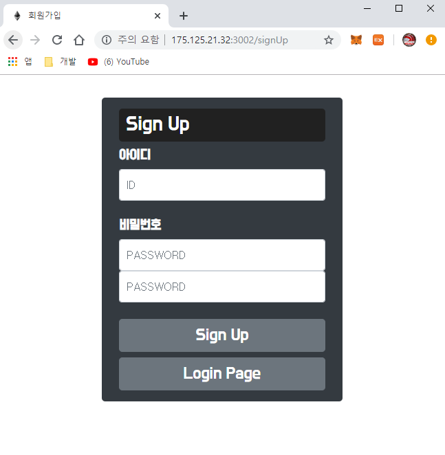
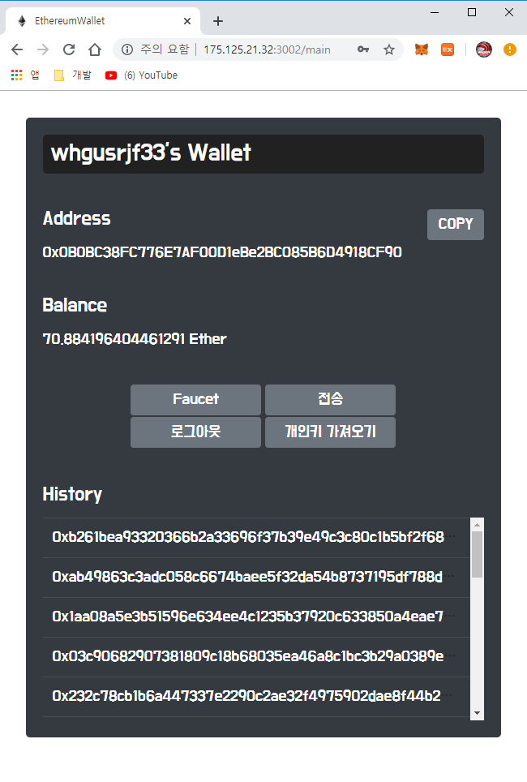
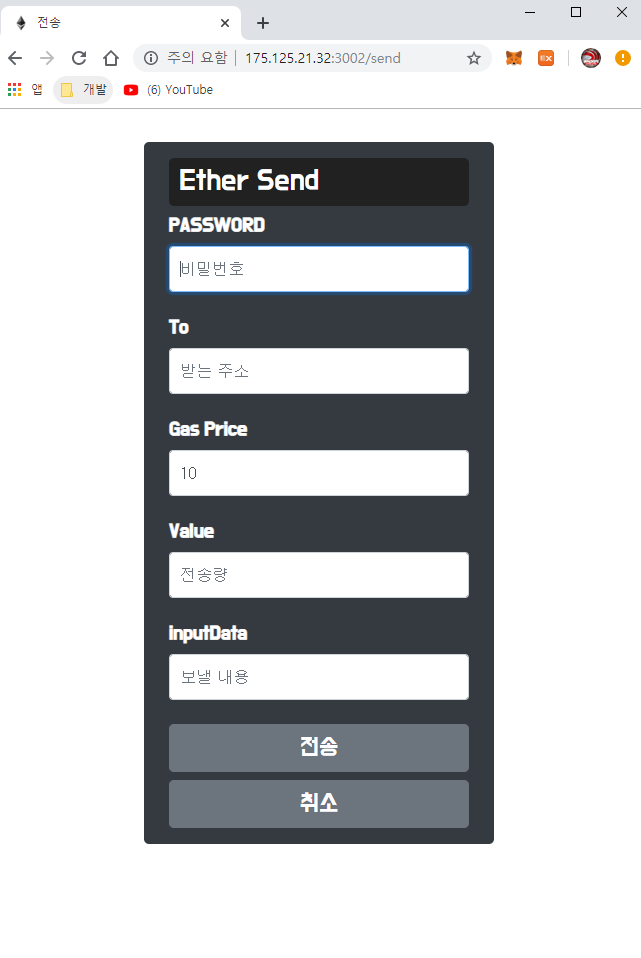

# EtherumWallet

회원가입 후 이더리움 계정을 발급받고 로그인하여 계정의 잔액, 이더리움 전송을 하는 웹 페이지
만약 기존의 개인키가 있다면 개인키를 통해 회원가입이 가능합니다.

### 사용방법
1. ##### 소스 내려받고 서버 실행하는 법
```
$ git clone https://github.com/Hyun-Geol/ethereumWallet
$ cd ethwallet
$ npm i
$ 시작옵션은 2가지가 있습니다.
$ 만약 코드가 변경되고 저장할때 마다 재실행 시키시려면(supervior사용)
$ npm run auto
$ 그냥 서버만 실행 시켜두시려면
$ npm run start
```

2. ##### 시작 페이지(로그인)
    

3. ##### 회원가입 페이지
    PASSWORD는 Bcrypto, PrivateKey는 CryptoJs로 암호화하여 보안을 조금이나마 하자고 노력했습니다.<br>
    Bcrypto는 단방향 암호화로 복호화시 리턴 값이 Boolean(참,거짓)으로만 나오기 때문에 로그인에 적합하다고 판단했습니다.<br>
    CryptoJs는 복호화시 리턴값에 암호화하기 전의 값을 받아올 수 있어서 PrivateKey를 반환해 줄 때 필요하다 생각하여 적용하였습니다.
    - (1) 계정생성

    

    - (2) PrivateKey로 계정생성

    

4. ##### 메인 페이지
    우선 메인 페이지에서는 자신의 Address주소, 잔액, TransactionHash값을 볼 수 있습니다.<br>
    그리고 파우셋을 누르게 되면 https://faucet.metamask.io/ 에 POST요청으로 Address값을 넣어 
    파우셋이 되도록 하였습니다.<br>
    TransactionHash값은 테이블의 크기를 제한하여 5개만 볼 수 있고 더 많은 해시값을 볼 수 있도록 
    스크롤바를 추가하여 모든 자신의 해시 값을 볼 수 있습니다.

    

5. ##### 전송 페이지
    전송페이지에서는 받는 주소가 없을경우 경고창을 띄어줍니다.<br>
    그리고 만약 자신의 잔액이 부족하면 경고창을 띄어줍니다.

    

6. ##### 프라이빗키 가져오기
    프라이빗키를 보려면 password를 입력하여 bcrypt로 암호화 한 후 db에 저장되어있는 password값을 bcrypt 내장함수로 비교한뒤 리턴 값이 참이면 PrivateKey를 복호화하여 반환 해주도록 하였습니다.
    
    
